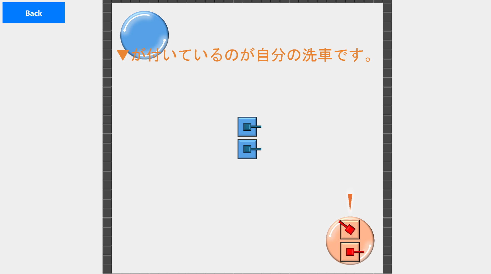
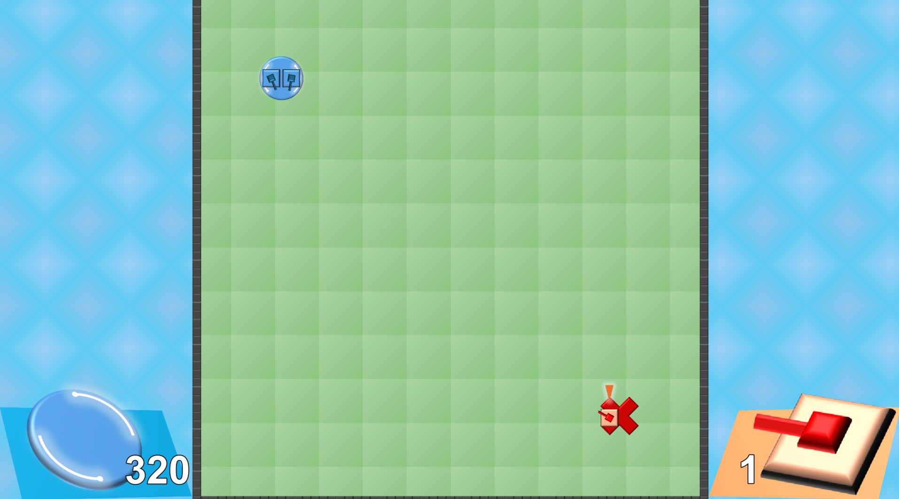

# Java演習

## １. ソフトの名前
「RESPAWN!!」

## ２. 実行画面のキャプチャ

### スタート画面

通常のTankクラスを継承したスタート画面用のStartScreenTankをステージに配置することで、アニメーションを実現しています。

### 遊び方画面

### プレイ画面(プレイ中)

## ３. プログラムの機能一覧表
クライアントのプログラムを実行するには、`start_game.bat`を実行してください。
### GameEngine.java

クライアントサイドのゲーム全体のメインエンジンです。

- **ゲームループ**: 固定フレームレート（FPS）でゲームループを管理し、`update()`（状態更新）と`draw()`（描画）を定期的に呼び出します。
- **オブジェクト管理**: `ScreenObject`（マーカーなど、クライアント側でのみ表示されるオブジェクト）のライフサイクルを管理します。
- **入力処理**: `InputStrategy` を通じてプレイヤーのキーボードやマウス入力を受け取り、プレイヤーの戦車（`myTank`）を操作します。
- **描画管理**: `GameStage`（ゲームワールド）と `GameUI`（UI要素）の描画を統括します。
- **カメラ制御**: プレイヤーの戦車を追従するカメラの位置やズームイン・ズームアウトを管理します。

### GameStage.java

ゲームの舞台となるステージの状態を管理するクラスです。

- **オブジェクト管理**: ステージ上に存在する全ての `GameObject`（戦車、弾、壁、基地など）を一元管理します。
- **物理演算**: オブジェクト同士の衝突判定を行います。衝突したオブジェクトには `onCollision()` メソッドを呼び出して通知します。
- **状態更新**: ステージ上の全オブジェクトの `update()` メソッドを呼び出し、状態を更新します。また、`isExpired()` が `true` を返したオブジェクトをステージから削除します。
- **描画**: 背景やステージ上の全オブジェクトを描画します。オブジェクトは `RenderLayer` に基づいて正しい順序で描画されます。
- **ゲーム情報提供**: `StageInfo` インターフェースを実装し、基地のHPや残りの戦車数、勝敗判定などの情報を提供します。

### Tank.java

プレイヤーが操作する戦車を表すクラスです。`GameObject` インターフェースを実装しています。

- **状態管理**: 位置、HP、砲塔の角度、所属チーム、ミサイルの保持状態など、戦車自身の状態を管理します。
- **アクション**: 移動、照準、弾の発射、ブロックの生成、ミサイルのチャージと発射など、戦車が行える全てのアクションをメソッドとして提供します。
- **ライフサイクル**: ダメージを受ける(`damage`)、破壊される(`onDie`)、リスポーンする(`respawn`)といった一連のライフサイクルを管理します。
- **衝突処理**: 他の `GameObject` と衝突した際の振る舞いを定義します（例：壁にぶつかった際にめりこまないように押し戻される）。
- **描画**: 戦車の状態（正常、破損、残骸、リスポーン中など）に応じた画像を、適切な位置・角度・大きさで描画します。

### GamePanelUI.java

ゲームプレイ中に表示されるUI全般を管理するクラスです。

- **UI要素の管理**: 画面に表示される全てのUI部品（`UIContent`）をリストで管理します。
- **情報表示**: 各チームの基地のHPや残りの戦車数を表示するカード、アイコン、テキストなどを初期化し、管理します。
- **状態更新**: 各UI要素の状態を更新します。ゲームが終了した際には、勝者を表示する `WinnerInfo` を生成し、終了音を再生します。
- **描画**: 管理している全てのUI要素を画面上の正しい位置に描画します。

## ４. アピールポイント

### 演出

#### アニメーション
- ゲーム画面 
  - 弾丸が弾ける時に、破片が周りに飛び散る演出
  - 戦車やブロックが破壊されたときに、破片が飛び散る演出
  - 戦車やブロックのダメージが大きくなった時に、ひびが入る演出
- スタート画面
  - 戦車が動いている
  - ゲームタイトルが回転している。

#### 効果音
- 戦車やブロックのダメージが大きくなった時に、ひびが入る音が鳴る
- 戦車やブロックが破壊されたときに音が鳴る

#### 衝突判定
- 始めは簡単のために、円形の衝突判定しか実装していなかったが、見栄えのために、長方形の衝突判定を実装した。こだわりは、相手の戦車にぶつかりに行ったときに、まっすぐ押し出すことができるという点です。円形の衝突判定では、あたりに行っても力が逃げてなかなか相手を押し出すことはできませんが、長方形の衝突判定なら相手を押し出すことができます。

#### デザイン
- 画像はすべてPowerPointで自分で作成しました。こだわりポイントは、メインのゲーム画面の左下と右下にあるゲーム情報を表示する箇所です。これらは、赤チームと青チームで向かい合う形でデザインされています。

#### ゲーム性
- 大人数でプレイするととても楽しくなるというゲームです。(提出のソースコードでは、4人集まったら開始るように設定してあります。 `PLAYER_COUNT`定数を変えることでその人数を設定できます。)

### ソフトウェアの設計

#### `GameEngine`の周辺
GameEngineを再利用できるようにした。
- InputStrategy
  - 画面によって応答する入力が違うから、各GamePanelごとにInputHandlerからの入力の捌き方を定義した。こうすることで、GameEngineは入力の捌き方が違ったとしても、何も気にする必要の内容にした。
- StageGenerator
  - 画面によって、生成するステージが違うので、その違いをGameEngineやGameStageが気にしなくても済むようにした。

## ５. 演習の感想

今回の演習での一番学びは、「自分の持っている知識だけで戦わないこと」。
今回は、前から使っていたJavaでの開発だったので「初めてやっている感」をあまり持つことがなく、
AIやGoogle検索などで調査をせずに自分の考えだけで突っ走ってしまいました。
その結果、前半のオセロについてはクラスを分けすぎて作りずらくなってしまい、後半の自由課題については自分の開発したいものに合った方法でなかったせいで、開発が遅れてしまいました。
途中から、AIなどを積極的に使って開発をするようになったのですが、新しい知識や考え方をAIから学ぶことができたので、とても有意義でした。
AIの書いたコードを写経やコピペをすることはありましたが、必ず理解をするようにすることで、途中からAIに頼らずにコーディングできるようになれたのでただしいAIの使い方だったと思います。