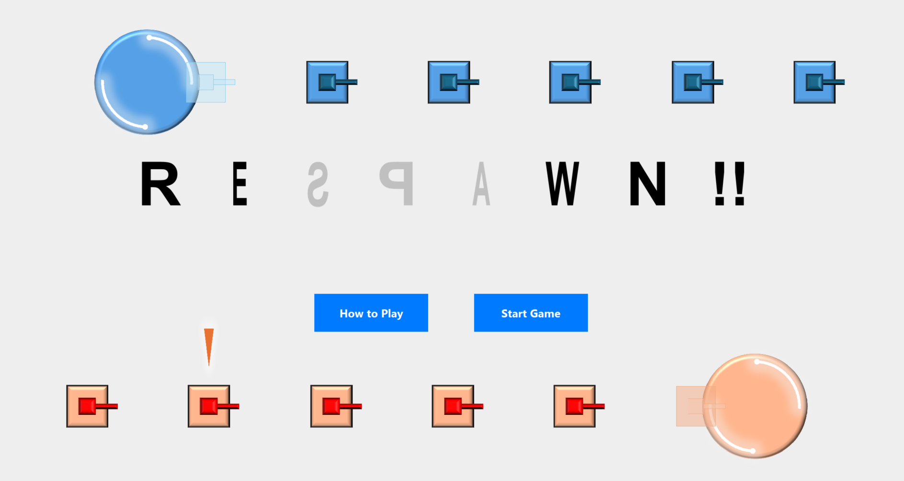
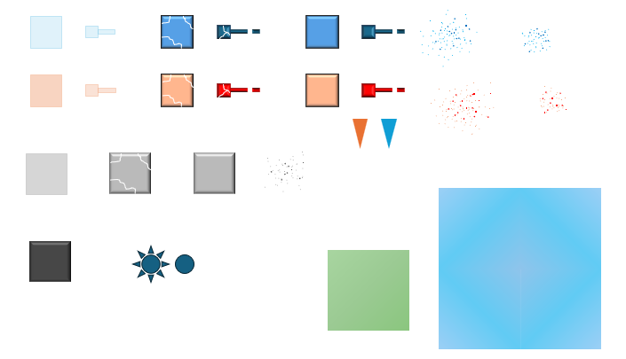

# Java演習

## １. ソフトの名前
「RESPAWN!!」

## ２. 実行画面のキャプチャ

### スタート画面

通常のTankクラスを継承したスタート画面用のStartScreenTankをステージに配置することで、アニメーションを実現しています。

### 遊び方画面

### プレイ画面(プレイ中)

### プレイ画面(勝利が決した瞬間)

### プレイ画面(再スタート画面)

###  

## ３. プログラムの機能一覧表
- 

## ４. アピールポイント

### 演出

#### アニメーション
- ゲーム画面 
  - 弾丸が弾ける時に、破片が周りに飛び散る演出
  - 戦車やブロックが破壊されたときに、破片が飛び散る演出
  - 戦車やブロックのダメージが大きくなった時に、ひびが入る演出
- スタート画面
  - 戦車が動いている
  - ゲームタイトルが回転している。

#### 効果音
- 戦車やブロックのダメージが大きくなった時に、ひびが入る音が鳴る
- 戦車やブロックが破壊されたときに音が鳴る

#### 衝突判定
- 始めは簡単のために、円形の衝突判定しか実装していなかったが、見栄えのために、長方形の衝突判定を実装した。こだわりは、相手の戦車にぶつかりに行ったときに、まっすぐ押し出すことができるという点です。円形の衝突判定では、あたりに行っても力が逃げてなかなか相手を押し出すことはできませんが、長方形の衝突判定なら相手を押し出すことができます。

#### デザイン
- 画像はすべてPowerPointで自分で作成しました。こだわりポイントは、メインのゲーム画面の左下と右下にあるゲーム情報を表示する箇所です。これらは、赤チームと青チームで向かい合う形でデザインされています。

#### ゲーム性
- 大人数でプレイするととても楽しくなるというゲームです。(提出のソースコードでは、4人集まったら開始るように設定してあります。 `PLAYER_COUNT`定数を変えることでその人数を設定できます。)

### ソフトウェアの設計

#### `GameEngine`の周辺
GameEngineを再利用できるようにした。
- InputStrategy
  - 画面によって応答する入力が違うから、各GamePanelごとにInputHandlerからの入力の捌き方を定義した。こうすることで、GameEngineは入力の捌き方が違ったとしても、何も気にする必要の内容にした。
- StageGenerator
  - 画面によって、生成するステージが違うので、その違いをGameEngineやGameStageが気にしなくても済むようにした。

## ５. 演習の感想

今回の演習での一番学びは、「自分の持っている知識だけで戦わないこと」。